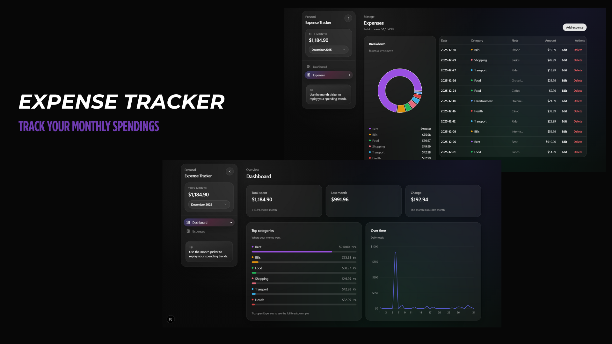

# Expense Tracker
 
 Premium personal expense tracker dashboard (single-user, no auth).
 
 
 
 ---
 
 ## Tech Stack
 
 ### Frontend
 - Next.js (App Router)
 - TypeScript
 - Tailwind CSS
 - shadcn/ui
 - Recharts
 - Framer Motion
 
 ### Backend
 - PHP (clean controller-style endpoints)
 - MySQL (XAMPP)
 
 ---
 
 ## Repo Structure
 
 ```txt
 expense/
   README.md
   frontend/        # Next.js app
   backend/         # PHP API + MySQL schema
 ```
 
 ---
 
 ## Features
 
 - Add / edit / delete expenses
 - Fixed categories (seeded)
 - Monthly totals + month selector
 - Category breakdown (pie on Expenses page)
 - Over-time trend (daily totals)
 - Responsive UI + mobile sidebar drawer
 - Delete confirmation via shadcn AlertDialog
 - Note truncation with tooltip for full text
 
 ---
 
 ## Setup (XAMPP + MySQL)
 
 ### 1) Start XAMPP Services
 In **XAMPP Control Panel**:
 - Start **Apache**
 - Start **MySQL**
 
 ### 2) Import Database Schema
 Open phpMyAdmin:
 - http://localhost/phpmyadmin
 
 Import:
 - `backend/database/schema.sql`
 
 This creates:
 - Database: `expense_tracker`
 - Tables: `categories`, `expenses`
 - Seeded categories
 
 ### 3) Serve the Backend via Apache
 Apache serves from:
 - `C:\xampp\htdocs\`
 
 Recommended approach (keep repo on Desktop): create a junction:
 - `C:\xampp\htdocs\expense-api` -> `C:\Users\Admin\Desktop\expense\backend`
 
 API base:
 - `http://localhost/expense-api/api`
 
 Verify in browser:
 - `http://localhost/expense-api/api/categories.php`
 
 ### 4) Backend env
 Create `backend/.env`:
 
 ```env
 DB_HOST=127.0.0.1
 DB_PORT=3306
 DB_NAME=expense_tracker
 DB_USER=root
 DB_PASS=
 ```
 
 ---
 
 ## Frontend Setup (Next.js)
 
 ### 1) Configure API base URL
 Create/edit `frontend/.env.local`:
 
 ```env
 NEXT_PUBLIC_API_BASE=http://localhost/expense-api/api
 ```
 
 ### 2) Install & Run
 
 ```bash
 cd frontend
 npm install
 npm run dev
 ```
 
 Open:
 - http://localhost:3000
 
 ---
 
 ## REST API
 
 Base:
 - `http://localhost/expense-api/api`
 
 ### Categories
 - `GET /categories.php`
 
 ### Expenses
 - `GET /expenses.php?month=YYYY-MM&limit=100`
 - `POST /expenses.php` body: `{ amount, category_id, date, note? }`
 - `PUT /expenses.php?id=123` body: `{ amount, category_id, date, note? }`
 - `DELETE /expenses.php?id=123`
 
 ### Dashboard
 - `GET /dashboard.php?month=YYYY-MM`
 
 Returns:
 - Monthly totals
 - Category totals
 - Over-time daily totals (frontend fills missing days with 0)
 
 ---
 
 ## Troubleshooting
 
 ### Demo image not showing on GitHub
 - Confirm the file exists: `frontend/public/ProjectDemo.png`
 - Confirm the README path matches exactly.
 
 ### API errors
 - Confirm Apache is running in XAMPP.
 - Confirm this opens in the browser:
   - `http://localhost/expense-api/api/categories.php`